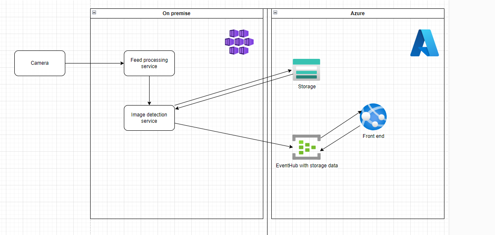

# People Detection App

## Introduction

The people detection app accepts inputs from a video file or RTSP camera feed and publishes clips in which there were people detected in the input video.  The input and output paths are configurable as is the properties of the output feed such as FPS and video dimensions.  

## Future work

1. Relaying output video to an Azure storage account 
2. Containerizing the app so that it runs in an Azure Kubernetes Service cluster
3. Creating a front-end app that will display the output video on demand
4. Implementing different people detection algorithms which can be configured at runtime
   
## Aspirational architecture

The reference architecture we are looking to implement is below:

